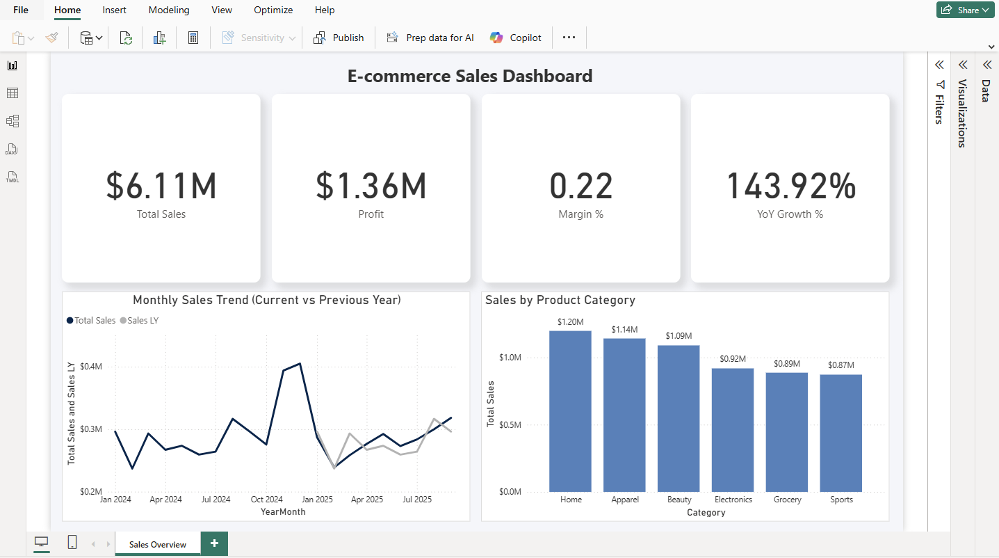

# 📊 Erica Tennyson | Power BI Portfolio

## About Me
I am a bilingual (English–Japanese) data and communication professional with over ten years of experience in digital marketing analytics, reporting automation, and cross-cultural content evaluation.

My background spans business intelligence, campaign performance analysis, and multilingual reporting for global clients in Japan and the U.S. I create data-driven insights and visualizations using Power BI, Excel, and GA4 to support strategic decision-making and process improvement.

I am now expanding my portfolio into HR and workforce analytics, focusing on data-driven dashboards that support evidence-based decision-making in both public and private organizations.

My goal is to apply analytics to enhance organizational effectiveness, transparency, and long-term performance.

---

## 🧩 Featured Project
### [E-commerce Sales Dashboard (Power BI)](./ecommerce-sales-dashboard)
An interactive Power BI dashboard analyzing online retail sales performance.

**Key Insights:**
- Total Sales, Profit, Margin %, YoY Growth %
- Monthly and Category-level trends
- Star schema model with DAX measures

🖼 Preview:  


---

## 🛠 Tools & Skills
- Microsoft Power BI Desktop  
- DAX / Power Query (M)  
- Data Modeling (Star Schema)  
- Visualization Design & KPI Reporting  
- Bilingual Documentation (EN / JP)

---

## 📂 Repository Structure
```
powerbi-portfolio/
│
├── ecommerce-sales-dashboard/
│   ├── Ecommerce_Sales_Dashboard.pbix
│   ├── Ecommerce_Sales_Dashboard.PNG
│   └── README.md
│
└── README.md
```
---

## 👩‍💻 Author
**Erica Tennyson**  
📍 Anderson, South Carolina, USA  
🎓 Digital Marketing & Data Analytics (Bilingual JP/EN)  
🔗 [LinkedIn](https://www.linkedin.com/in/erica-tennyson-sc/)  

---

⭐ *Thank you for visiting! Feel free to explore my dashboards or connect on LinkedIn.*
