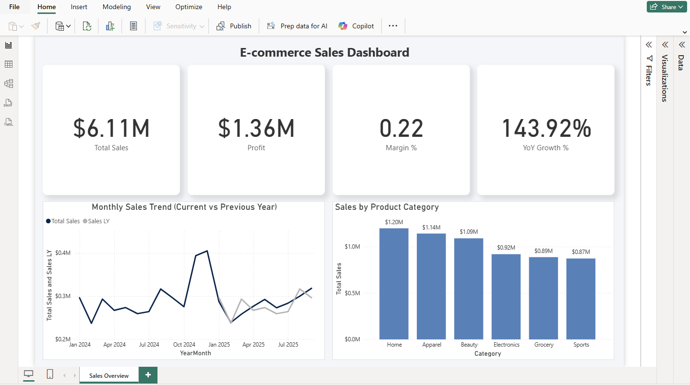

# 🛍️ E-commerce Sales Dashboard (Power BI)

An interactive Power BI dashboard analyzing e-commerce sales performance.  
This project demonstrates data modeling, DAX calculations, and clean BI design — built as part of a Power BI portfolio for analyst roles.

---

## 🌐 Languages / 言語
- English 🇺🇸 / Japanese 🇯🇵 (bilingual documentation support)
- Power BI Desktop (.pbix)
- DAX & M Query for data transformation

---

## 📊 Overview

The dashboard provides insights into:
- **Total Sales**
- **Profit**
- **Margin %**
- **YoY Growth %**

It also includes:
- 📈 *Monthly Sales Trend (Current vs Previous Year)*  
- 🏷️ *Sales by Product Category*  

---

## 🧱 Data Model / データモデリング構造

This project uses a **Star Schema**, consisting of one fact table and three dimension tables:

| Table Name | Type | Description |
|-------------|------|--------------|
| **FactSales** | Fact | Transaction-level sales data |
| **DimDate** | Dimension | Calendar and time hierarchy for time intelligence |
| **DimProduct** | Dimension | Product attributes (Category, Subcategory, Brand, Cost, Price) |
| **DimCustomer** | Dimension | Customer attributes (Region, Gender, Age Group) |

📊 **Relationship Overview:**
```
DimDate ───┐
DimProduct ─┼──▶ FactSales ◀── DimCustomer
```

---

## ⚙️ DAX Measures

| Measure | Formula | Description |
|----------|----------|-------------|
| **Total Sales** | `SUM(FactSales[Sales])` | Calculates total sales |
| **Profit** | `SUM(FactSales[Profit])` | Calculates total profit |
| **Margin %** | `DIVIDE([Profit], [Total Sales])` | Profit margin ratio |
| **Sales LY** | `CALCULATE([Total Sales], SAMEPERIODLASTYEAR(DimDate[Date]))` | Last year’s sales |
| **YoY Growth %** | `DIVIDE([Total Sales] - [Sales LY], [Sales LY])` | Year-over-year growth |

---

## 🎨 Design & Visuals

- Light gray background with floating shadow cards  
- Rounded corners for KPIs  
- Clean typography (Segoe UI / 16pt headlines)  
- Consistent color theme (navy blue, light gray, white)  
- Focused on clarity for **business decision makers**  

---

## 📂 Files Included
| File | Description |
|------|-------------|
| `Ecommerce_Sales_Dashboard.pbix` | Power BI dashboard file |
| `Ecommerce_Sales_Dashboard.PNG` | Dashboard preview image |
| `README.md` | Project documentation |

---

## 📸 Dashboard Preview



---

## 🧠 Learning Focus

This project demonstrates:
- Power BI data modeling (Star Schema)
- DAX for business KPIs
- Dashboard layout and formatting best practices
- Analytical storytelling with visuals

---

## 💬 Author

**Erica Tennyson**  
📍 Anderson, South Carolina, USA  
🎓 Digital Marketing & Data Analytics (Bilingual JP/EN)  
🔗 [LinkedIn](https://www.linkedin.com/in/erica-tennyson-sc/)

---

## 📌 Tags

`#PowerBI` `#DAX` `#DataAnalytics` `#Ecommerce` `#PortfolioProject`
